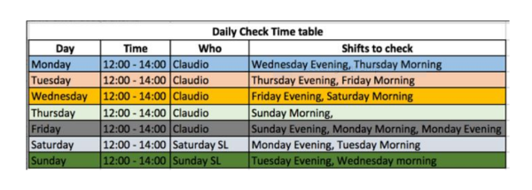

---
title: "ReadMe"
author: "Madhu"
date: "`r format(Sys.time(), '%d %B, %Y')`"
output: html_document
---  

```{r setup, include=FALSE}
knitr::opts_chunk$set(echo = TRUE)
```


## Guidelines to driver allotment app

1. Click on the corresponding link below

    [Berlin](https://shiny.zipjet.com/DemandPred_html/Berlin/DP_final_report_ops_Berlin.html)

    [London](https://shiny.zipjet.com/DemandPred_html/London/DP_final_report_ops_London.html)

    [Paris](https://shiny.zipjet.com/DemandPred_html/Paris/DP_final_report_ops_Paris.html)

2. Login : If prompted for login please use the login details mentioned below

+ Username: intwash
+ Password: cleanmeup

3. Check which shifts you have to check today

    
    
4. Crosscheck the table for the dates: Date of report and dates of  shift schedules

5. Note down the total umber of drivers from the table

6. Note down the total drivers already allotted from the backend

7. Adjust(add or remove) the number of drivers for the allotted shifts and days